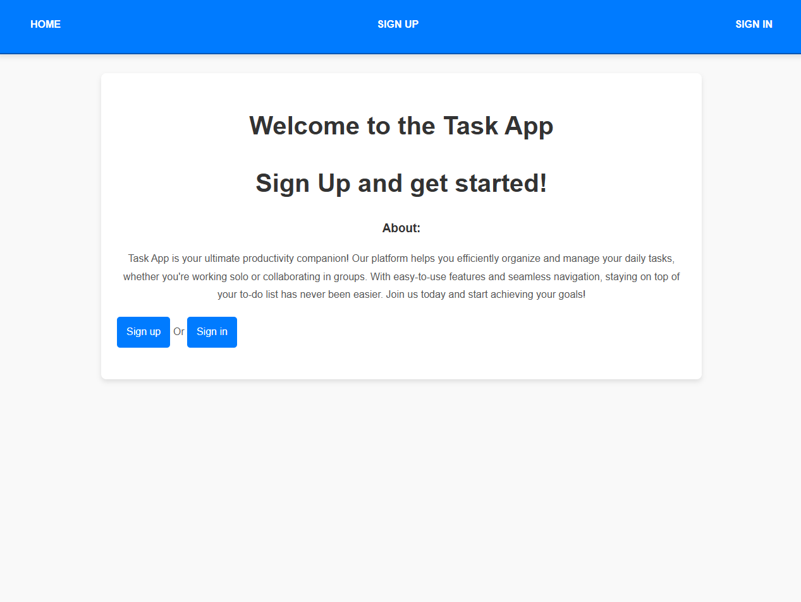
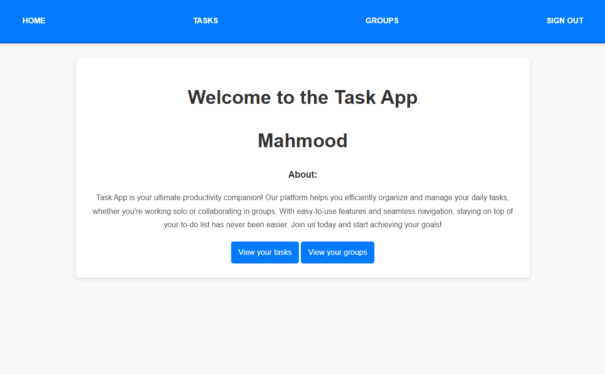
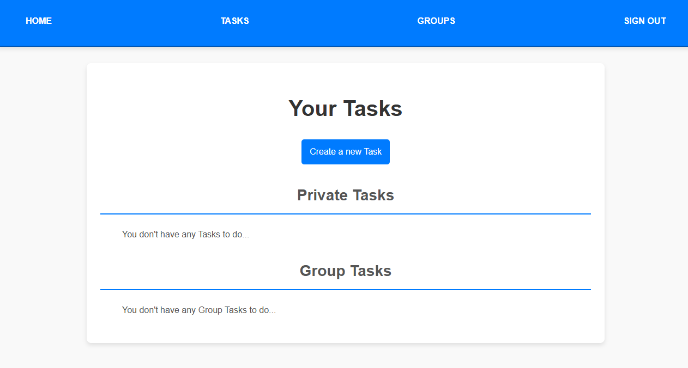
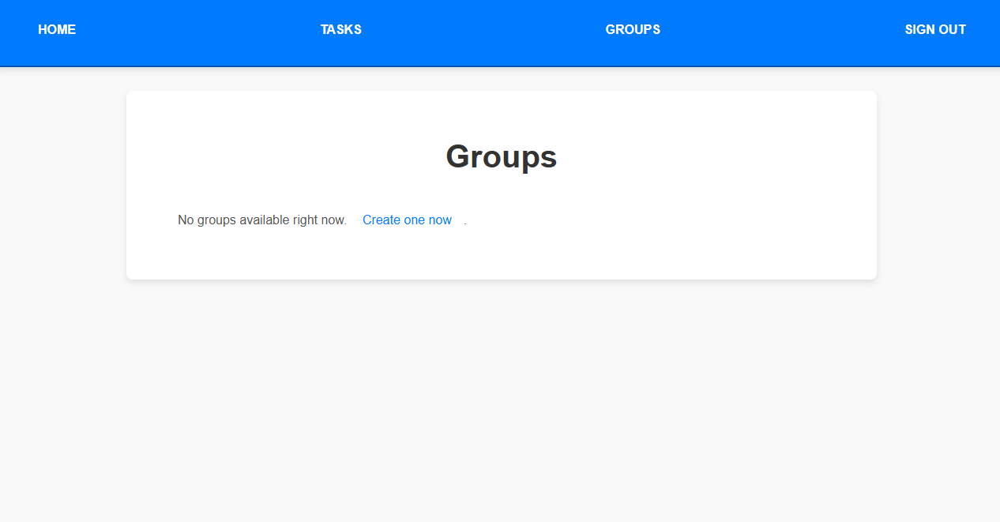
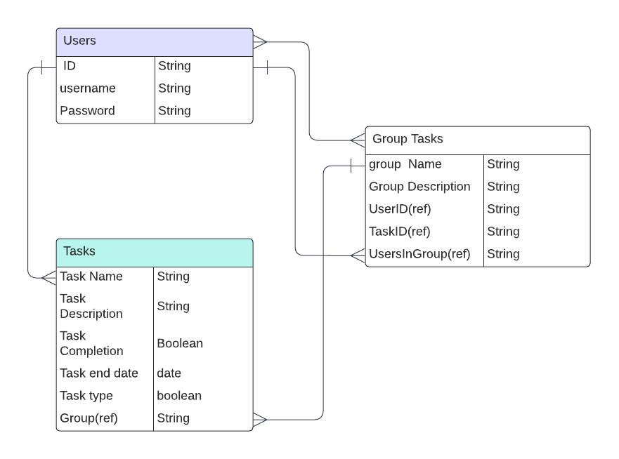

# Task App

## Description

- The Task App is a productivity tool that helps users create and manage tasks individually and within groups. This app provides functionalities for task creation, editing, deleting, and marking tasks as complete or incomplete. Additionally, it supports group collaboration where users can join groups, create shared tasks, and view the progress of other members' completed tasks.

## Home Page




## Task Page



## Groups Page



## User Stories

### 1. General User Stories:-

1. AAU, I can create my own tasks and set the name of the task and description and the task end date/time, as will as I can Edit the task and delete it.

2. AAU, I want to set the task to be complete and uncompleted.

### 2. MVP User Stories:-

1. AAU, I can create a group with others and we can create task to do it together.

2. AAU, I can see the completion of the other tasks that others do it.

## Pseudocode

- Show All Tasks
  The GET /task route fetches all tasks for the logged-in user.
  It queries tasks where either the user is the owner (taskOwner) or the user is a member of a group task (groupTask.members).
  Tasks are split into two categories: private tasks and group tasks, and then rendered on the task listing page.

- Create a New Task
  The GET /task/new route renders a form for creating a task.
  The POST /task route handles the form submission.
  It saves the task data to the database, associating it with the current user as the taskOwner.

- Mark a Task as Complete or Incomplete
  The PUT /task/:id/complete route sets the taskCompletion status to true.
  Similarly, the PUT /task/:id/uncomplete route sets taskCompletion to false.
  Both routes update the status in the database and redirect back to the task list.

- Edit a Task
  The GET /task/:id/editTask route renders a form for editing a specific task.
  The PUT /task/:id route updates the task details in the database using the form data.

- Delete a Task
  The DELETE /task/:id route deletes a task from the database.
  It ensures that the task is removed for all users in the case of group tasks.

- View Task Details
  The GET /task/:id route retrieves the details of a specific task.
  The task details are fetched from the database and displayed to the user.

- Show All Group Tasks
  The GET /groupTask route retrieves all groups, populating details about the group owner and tasks.
  It displays the list of all groups to the user.

- Create a New Group
  The GET /groupTask/new route renders a form for creating a new group.
  The POST /groupTask route processes the form submission.
  It saves the group to the database, associating the current user as the groupOwner.

- Join a Group
  The POST /groupTask/:id/join route allows a user to join a specific group.
  If the user is not already in the usersInGroup list, they are added to the group and the database is updated.

- Create a Task in a Group
  The POST /groupTask/:id/task route lets a user add a task within a group.
  The task is created with taskOwner as the current user and linked to the group's ID (groupTask).
  It is saved to the Task collection, and its ID is added to the group’s groupTask array.

- Show Group Details
  The GET /groupTask/:id route fetches details of a specific group.
  It retrieves the group, its owner, its members, and the tasks associated with it.
  The details are rendered on the group details page.

- Delete a Group
  The DELETE /groupTask/:id route deletes a group and all tasks associated with it.
  It ensures both the GroupTask and related tasks in the Task collection are removed from the database.

## ERD



## Getting Started

### Planning materials

1. Try the application [Task App](https://project2-saez.onrender.com)

2. [Trello](https://trello.com/b/1gG9otRK/task-app)

3. Wireframe
   
   
   

## Technologies Used

- Frontend: CSS, EJS
- Backend: Node.js, Express.js
- Database: MongoDB

## Attributions

1. For these query **_$or and $exists and $ne_** I got the information from

- [MongoDB](https://www.mongodb.com/docs/manual/reference/operator/query/or/)
- [MongoDB](https://www.mongodb.com/docs/manual/reference/operator/query/exists/)
- [MongoDB](https://www.mongodb.com/docs/manual/reference/operator/query/ne/)

**_My code_**

```javascript
router.get("/", async (req, res) => {
  try {
    const userId = req.session.user._id // Get the current user's ID
    const tasks = await Task.find({
      $or: [
        { taskOwner: userId }, // Private tasks owned by the user
        {
          groupTask: { $exists: true, $ne: null },
          "groupTask.members": userId,
        }, // Group tasks the user is a member of
      ],
    }).populate("groupTask")

    // Separate tasks for rendering
    const privateTasks = tasks.filter((task) => !task.groupTask)
    const groupTasks = tasks.filter((task) => task.groupTask)

    res.render("task/index.ejs", { privateTasks, groupTasks })
  } catch (error) {
    console.error("Error fetching tasks:", error)
    res.status(500).send("Server Error")
  }
})
```

## Next Step

- Task Notifications: Adding reminders for upcoming tasks.

- Task Filter: Implementing a feature to prioritize tasks by displaying those with the earliest deadlines at the top.
